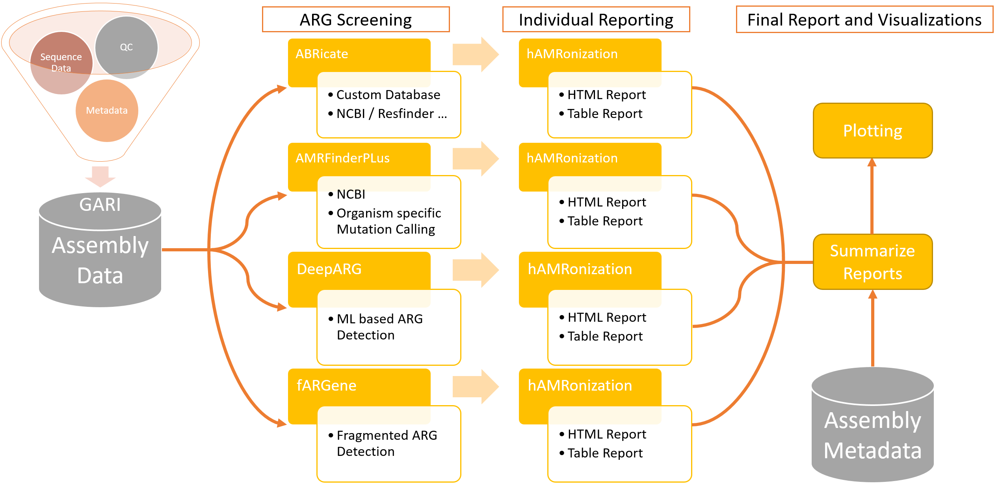

<p align="center">
  
</p>

## Table of Contents
1. [AMRFlow - A Pipeline for Integrated Genomic Surveillance of Antimicrobial Resistant Genes](#amrflow---a-pipeline-for-the-integrated-genomic-surveillance-of-antimicrobial-resistant-genes)
2. [Key Features](#key-features)
3. [Workflow Capabilities](#workflow-capabilities)
4. [Installation](#installation)
   - [Dependencies](#dependencies)
   - [Setup Tools and Databases](#setup-tools-and-databases)
5. [Usage Guide](#usage-guide)
   - [General Usage Examples](#general-usage-examples)
   - [Supported Engines with Nextflow](#supported-engines-with-nextflow)
   - [Global Pipeline Parameters](#global-pipeline-parameters)
   - [Tool Selection Parameters](#tool-selection-parameters)
   - [Tool Specific Parameters](#tool-specific-parameters)
   - [Database Folder Structure and Initialization](#database-folder-structure-and-initialization)
   - [Downloading Databases](#downloading-databases)
   - [Output](#output)


# **AMRFlow**  - A Pipeline for the Integrated Genomic Surveillance of Antimicrobial Resistant Genes

The **AMRFlow** pipeline is a specialized Nextflow-based, multi-tool workflow designed for the surveillance of important pathogens as part of the Integrated Genomic Surveillance Project. This repository hosts the core Nextflow scripts and modules necessary for conducting comprehensive antimicrobial resistance (AMR) profiling.

## Key Features
- **Flexible Tool Integration:** Supports multiple AMR detection tools including Abricate, AMRFinderPlus, and DeepARG (more comming soon).
- **Automated Database Updates:** Optional updates for databases of each tool, ensuring the use of the most current data for AMR detection.
- **Comprehensive Reporting:** Utilizes a standardization module to integrate results from various tools and summarize findings in a unified format.

## Workflow Capabilities
- **Modular Design:** Each component, from database updates to result summarization, is encapsulated in modules for easy maintenance and scalability.
- **Parameter Customization:** Allows for extensive customization of parameters such as database choice, analysis tool, identity thresholds, and coverage (accurate description of supported paremeters will be announced soon).
- **Pathogen-Specific Pipeline Configuration:** In the near future, AMRFlow will be capable of conducting pathogen-specific analyses by allowing users to provide custom configuration files.

<p align="center">
  
</p>


## Installation

To use **AMRFlow**, we recommend installing it via `nextflow` directly:

```bash
# install the pipeline
nextflow pull rki-mf1/amrflow
# check latest version
nextflow info rki-mf1/amrflow
# show help for a specific release version
nextflow run rki-mf1/amrflow -r 0.0.1

```


clone the repository and install the necessary dependencies.

```bash
https://github.com/rki-mf1/AMRFlow.git
cd AMRFlow
```

### Dependencies 
Install `Nextflow` to run the Pipeline. Depending on which environment management engine will be specified, `conda`, `mamba` or `singularity` needs to be set up.


### Setup Tools and Databases

This step is mandatory for setting up tools and their individual databases. For initial setup and updates, use the following command:

```bash
nextflow run AMRFlow.nf --update \
    --run_amrfinder \
    --run_deeparg \
    --run_abricate \
    --abricate_update_db ncbi \
    --db_dir /full/path/to/databases \
    -profile conda
```

## Usage Guide

To use the **AMRFlow** pipeline, you need to provide specific parameters to customize the analysis according to your needs. Below is a detailed description of each parameter used by the pipeline:

### General Usage Examples
```bash
nextflow run AMRFlow.nf --assembly_dir ./fastas --output_dir ./resultsA  --run_amrfinder  --db_dir ./databases -profile conda
nextflow run AMRFlow.nf --assembly_dir ./fastas --output_dir ./resultsB  --run_abricate --abricate_db resfinder --run_amrfinder --db_dir ./databases -profile mamba
nextflow run AMRFlow.nf --assembly_dir ./fastas --output_dir ./resultsC  --run_abricate --abricate_db ncbi --min_COV 90 --min_ID 80 --threads 32 -profile singularity
```

### Supported Engines with Nextflow
- `-profile conda`
- `-profile mamba`
- `-profile singularity`

### Global Pipeline Parameters

- `--assembly_dir <path>`: Path to a directory containing fasta files. Single fasta mode is not implemented yet.
- `--output_dir <path>`: Specifies the path where the output will be stored. Default is `/results`.
- `--db_dir <path>`: Path to the databases directory needs to be set. It is mandatory to set the full path to the global database directory.

### Tool Selection Parameters

No tools are defined as default. Include one or multiple of the following flags:

- `--run_abricate`: If set, Abricate will run with default parameters (`Min Identity 90, Min Coverage 90`).
- `--run_amrfinder`: If set, AMRFinder will run with default parameters (`Min Identity 90, Min Coverage 90`).
- `--run_deeparg`: If set, DeepARG will run with default parameters.
- `--run_fargene`: If set, fARGene will run with default parameters (`--hmm_model class_A`).

### Tool Specific Parameters

- `--min_ID <0-100>`: Minimum identity can be set for ABRicate and AMRFinder (Default `90`).
- `--min_COV <0-100>`: Minimum coverage can be set for ABRicate and AMRFinder (Default `90`).
- `--organism_amrfinder <Organism>`: Organism specific mutations identification. See AMRFinder list for supported Organisms (Default `none`).
- `--hmm_model_fargene <model>`: Setup model for antibiotic class specific AMR detection. See fARGene documentary for supported models (Default `class_A`).
- `--no_summary`: The last step of AMRFlow summarizes all results ourputed by each tool. If this is not needed, this can be set of by using this flag. 

### Database Folder Structure and Initialization

Before running the **AMRFlow** pipeline, ensure you have downloaded all necessary databases by running the **AMRFlow** initialization step mentioned above. The databases should then be organized in the following folder structure:

```
db
├── abricate
│   ├── ncbi
│   ├── resfinder
│   └── ...
├── amrfinder
│   └── database files
└── deeparg
    └── database files
```

### Downloading Databases

Use the `--update` feature of **AMRFlow** to download the required databases into one directory. Here are the commands to update each tool's database:

For AMRFinderPlus, ABRicate and DeepARG:
```sh
nextflow run amrflow --update --run_amrfinder --db_dir /full/path/to/dbs

nextflow run amrflow --update --run_abricate --abricate_update_db ncbi --db_dir /full/path/to/dbs

nextflow run amrflow --update --run_deeparg --db_dir /full/path/to/dbs
```

The `--update` feature will generate a single directory, named after the assigned tool, within the defined path, that contains the database. The defined path should not include the tool name, but only the generic path to a directory that will contain all databases.


### Output

The generated output will be split into multiple intermediate results and summaries. This will be strucktured in the following way:

```
<output_dir>
├── 01_AMR_results
│   ├── tool_1
│   ├── tool_2
│   └── ...
├── 02_hAMRonization
│   ├── tool_1
│   ├── tool_2
│   └── ...
├── 03_hAMRonization_summarize
│   ├── summarized_reports
│   ├── presence_absence_tool
│   └── summarized_reports_tool
└── 04_visualizations
```

Each folder is structured as follows:

- **01_AMR_results**: Contains output files from different AMR detection tools. Each tool's output is stored in its respective subfolder.
- **02_hAMRonization**: Holds the standardized outputs of the AMR detection tools. Each tool has its outputs standardized and stored separately.
- **03_hAMRonization_summarize**:
  - **summarized_reports**: Includes overall summaries of the standardized AMR data (tsv and html).
  - **presence_absence_tool**: Contains data detailing the presence or absence of specific AMR genes as detected across the samples per tool.
  - **summarized_reports_tool**: Features tool-specific summarized reports (tsv and html).
- **04_visualizations**: Contains visual representations (graphs, charts, etc.) of the summarized AMR data to aid in data interpretation and analysis.


## Credits
AMRFlow was originally writen by Mustafa Helal

We thank the following people for their extensive assistance in the development of AMRFlow:

Maximilian Driller, Silver A. Wolf, Torsten Houwaart, Lakshmipriya Thrukonda, Vladimir Bajić


This pipeline uses code and infrastructure developed and maintained by the nf-core community, reused here under the MIT license.
